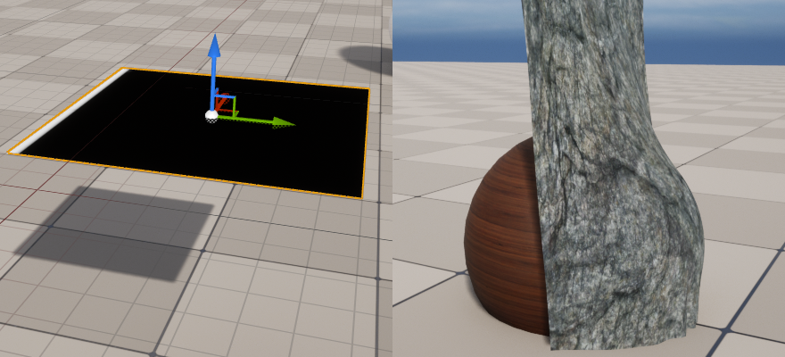
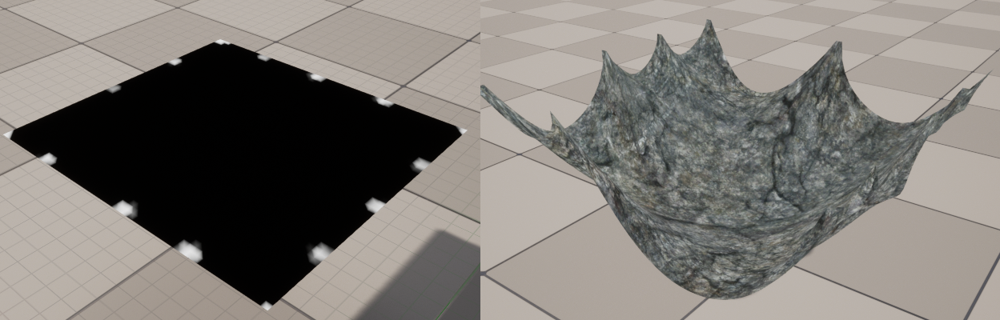
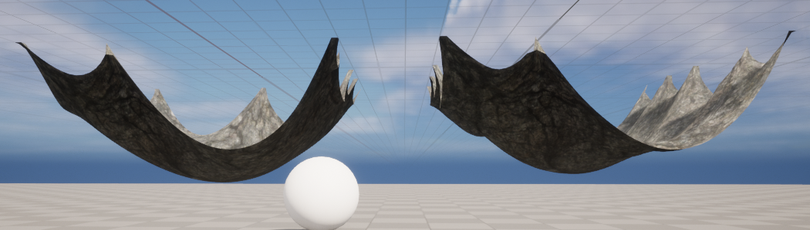
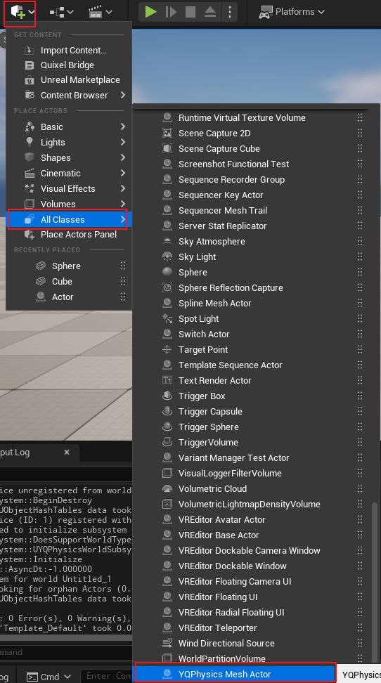
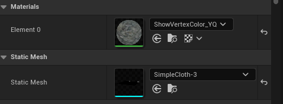
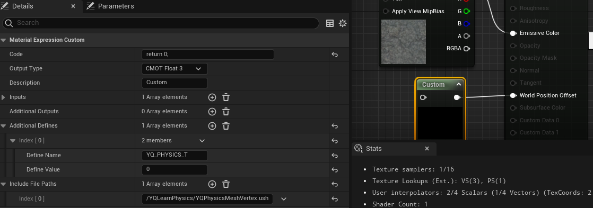
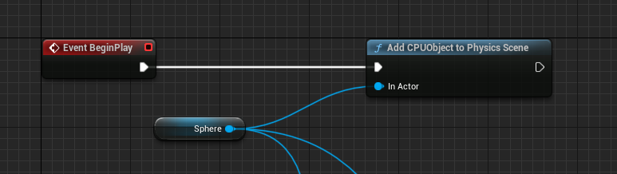
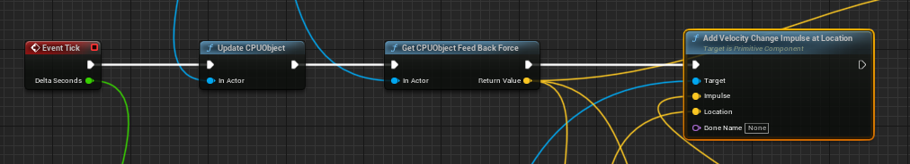

# 基于PBD的模拟的练习
在UE上练习用GPU做物理模拟，尽可能不修改引擎，在插件中做全部，仍在施工中。     
# 模拟器类
使用了UE提供的WorldSubSystem实现了两个生命周期托管到引擎的单例类，PhyscisScene
和PhysicsSimulator，每一次tick时，PhyscisScene首先会整理各种Object的数据，遍历待加入到GPU场景的物体的列表，通过计算着色器将物体的数据写入到各种buffer中，比如位置buffer，同时根据需求产生约束。   

# 布料
当前使用StaticMesh来生成布料粒子和约束，顶点色的R通道用来标定哪些是固定点。顶点色可以用引擎自带的工具来刷。     

  

  

当然使用顶点色并不是最好的方式，理论上物理的数据应该和渲染的数据分开，不过这需要些时间来读UE当前布料资产的代码。  
## 距离约束

约束是使用IndexBuffer生成的，计算着色器的每个线程读取IndexBuffer中的3个值，然后生成3个距离约束。  
这样会有重复的约束生成，因为一个边可能被两个三角形共享。所以我做了一个GPU上的去重操作，大概就是结合排序和求前缀和   

大概流程如下  
* [3, 5, 3, 4, 1, 4, 9, 8, 6, 3, 5, 7, 8, 8, 4, 6, 4, 2, 5, 6] -- 0
* 排序，得到排序后的buffer，  
  [1, 2, 3, 3, 3, 4, 4, 4, 4, 5, 5, 5, 6, 6, 6, 7, 8, 8, 8, 9] -- 1  
* 对buffer-1 判断一个位置是否是连续相同数据(segment)的边界，其实就是判断左边的数据和自己是否相同   
  [1, 1, 1, 0, 0, 1, 0, 0, 0, 1, 0, 0, 1, 0, 0, 1, 1, 0, 0, 1] -- 2
* 对buffer-2 进行归约操作就能得到每个标为1的值的输出位置，进而将buffer压缩成unique的

也是参考了[tensorflow的做法](https://github.com/tensorflow/tensorflow/blob/master/tensorflow/core/kernels/unique_op_gpu.cu.h)。  

## 弯曲约束

  
左侧的布料没有弯曲约束，右侧的有  

现在增加了基于距离约束的弯曲约束，参考chaos的实现，简单地约束两个有共享边的三角中除了共享边以外的两点的距离。   

生成弯曲约束的算法和生成距离约束类似，区别在于这一次是寻找那个重复的，也就是说，如果左边的数据和自己相同，则为1，和距离约束的情况相反。当一个边的标识为1时，就将自己所在的三角形的id和buffer中左侧的边的三角形id输出，这样就找到了两个有共享边的三角形。  

# SceneComponent
有了网格体资源之后，场景中用自定义的PrimitiveComponent来显示模拟的物体，自定义vertexfactory来fetch模拟出的顶点位置和法线，这可能带来大量的shader编译 (也是我开发时的困扰点，这很浪费时间)。   

新建一个`YQPhysicsMeshActor`，这会自动创建一个我自定义的`PrimitiveComponent`  

    

随后在detail面板中设置材质和网格体  
    

这里的材质并非什么都行，因为我用的是自定义的顶点工厂，可以在材质中自定义部分顶点着色器的行为。  
下图中，我使用custom节点让shaderinclude了我写的ush文件，这样就让这个ush文件中的代码起效，进而读取位置buffer  
    

不过现在有bug，有时候没有重新创建渲染状态，导致组件消失不见。这个问题还需要研究一下。
# 计算约束
距离约束统一保存在三个buffer当中，静态距离buffer、粒子A的ID的buffer、粒子B的ID的buffer。每次迭代都用计算着色器计算某一种约束，并将位置的变化量累积到buffer当中。  
这里的问题是，一个粒子可能被多个约束引用，所以写入时会有同步问题。这个问题暂时没研究透彻，现在是将变化量转为整形，然后用原子操作进行累加。    
另一种想到的方式是，我们可以在添加物体时，计算出每个约束对buffer的输出位置，这样可以在输出时，将同一个粒子的变化量输出到连续的空间，下一步用计算着色器做累加。  

# 与CPU物体的交互
当前设想是分为GPU上运算的物体和CPU上运算的物体(引擎自己的物理计算)，但这样两者之间的交互就成了问题。   

现在是利用蓝图，将CPU物体添加到我的物理场景中 

    

每一次Tick都向插件同步当前的位置和速度，然后从插件中获取反馈

    

代码中，CPU物体添加到场景时会生成 `FCPUObjectProxy`，参考UE的 `SceneProxy`，每一次gamethread更新位置时，都会添加一条更新信息的Command，然后当renderthread中我的物理场景更新的时候，一起依据这些command更新renderthread里面的proxy的数值，保障线程的同步。    

```cpp
TMap<FCPUObjectProxy*, FUpdateCPUObjectTransformCommand> UpdatedCPUObjectTransformsRenderThread;
```

如果想要在预览窗口起效果，可以将`BeginPlay`相关逻辑移到`Construction Script`当中。

    

不过要记得将蓝图中的`Run Construction Script on Drag`取消，不然在拖拽时会不断创建物理代理。   

    


# 碰撞
碰撞还没做好，现在并没有真正的生成碰撞约束流，而是在其他约束计算之后，在一次dispatch中计算碰撞检测和反馈。  
每个线程对CPU物体的反馈(可能没有) 使用求前缀和的方式输出到Buffer中，然后cpu读取。  

```cpp
uint Thread = GroupThreadId.x;
GroupWriteOffsets[Thread] = bIsCollis;
GroupMemoryBarrierWithGroupSync();

// 线程组内部求前缀和
int OutBuffer = 0, InBuffer = 1;

[unroll]
for (uint Offset = 1; Offset < THREAD_COUNT; Offset = Offset << 1)
{

    OutBuffer = 1 - OutBuffer;
    InBuffer = 1 - InBuffer;
    if (Thread >= Offset)
    {
        GroupWriteOffsets[OutBuffer * THREAD_COUNT + Thread] = GroupWriteOffsets[InBuffer * THREAD_COUNT + Thread - Offset] + GroupWriteOffsets[InBuffer * THREAD_COUNT + Thread];
    }
    else
    {
        GroupWriteOffsets[OutBuffer * THREAD_COUNT + Thread] = GroupWriteOffsets[InBuffer * THREAD_COUNT + Thread];
    }

    GroupMemoryBarrierWithGroupSync();
}

// 线程组之间累加输出位置

if (Thread == 0)
{
    uint NumGroupFreeIDs = GroupWriteOffsets[(OutBuffer + 1) * THREAD_COUNT - 1];
    InterlockedAdd(FeedbackSizesBuffer[0], NumGroupFreeIDs, GroupWriteStart);
}

GroupMemoryBarrierWithGroupSync();

// 得到了线程组内和外的输出位置偏移，可以写了
if (bIsCollis)
{
    uint WriteOffset = GroupWriteStart + GroupWriteOffsets[OutBuffer * THREAD_COUNT + Thread] - bIsCollis;
    FeedbackBuffer[WriteOffset] = half4(NewColliderVelocity, 1.0);
}
```


这里一个尚未解决的问题是，如何对 "渲染线程写，game线程读"的方式进行同步。  
